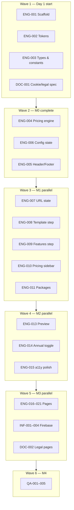

# CodedPixels — Implementation Tickets

**Coordinator:** Dr. Nathan Cole  
**Decomposition:** Dr. Maya Patel  
**Status:** Ready for parallel agent execution  
**Repo:** Single Next.js 15 app (no Turborepo until Platform Phase 2 B0)

---

## How to use this doc

| Field | Meaning |
|-------|---------|
| **Lane** | Workstream that can be owned by one agent without merge conflicts |
| **Wave** | Earliest wave when ticket can start (same wave = parallel OK if deps met) |
| **Blocked by** | Ticket IDs that must complete first |
| **Parallel with** | Safe to run simultaneously in another lane |

**Max parallelism:** Up to **6 agents** in Waves 2–4; **4 agents** in Wave 1; **5 agents** in M3 pages wave.

### Critical-path tickets (do not rush)

| ID | Why it matters |
|----|----------------|
| **ENG-004** | Authoritative money math — all totals, annual toggle, checkout |
| **ENG-006** | URL config state — shareable links, persistence, partial restore (Q40); backbone of the configurator |
| **DOC-001** | Zero engineering deps — start anytime; only blocks Wave 5 PII/legal work |

**Wave 3 gate:** No configurator UI ticket (ENG-007+) starts until **ENG-006** round-trip tests are solid.

---

## Execution overview



---

## Lane map (minimize file conflicts)

| Lane | Owns | Agents |
|------|------|--------|
| **A — Foundation** | `app/layout.tsx`, `globals.css`, `components/layout/*`, scaffold config | 1 |
| **B — Pricing core** | `lib/pricing.ts`, `lib/config-state.ts`, `lib/packages.ts`, `lib/features.ts`, `*.test.ts` | 1 |
| **C — Configurator UI** | `components/configurator/*`, `app/page.tsx` configurator section | 1–2 |
| **D — Pages** | `app/templates/*`, `app/pricing/*`, `app/get-started/*`, `components/sections/*` | 1–2 |
| **E — Firebase/Infra** | `functions/*`, `firestore.rules`, `firebase.json` | 1 |
| **F — Docs/Legal** | `docs/*`, `app/privacy/*`, `app/terms/*` | 1 |

---

# WAVE 1 — Kickoff (parallel: 4 agents)

### ENG-001 · Next.js 15 scaffold
| | |
|--|--|
| **Lane** | A — Foundation |
| **Wave** | 1 |
| **Blocked by** | — |
| **Parallel with** | ENG-002, ENG-003, DOC-001 |

**Scope:**
- `create-next-app` App Router, TypeScript, Tailwind 4.x, ESLint
- Single app at repo root ( **not** Turborepo)
- Folder structure per project plan §7
- `next.config.ts`, `tsconfig` strict

**Acceptance:**
- [ ] `npm run dev` serves blank page
- [ ] `npm run build` passes

---

### ENG-002 · Design tokens & globals.css
| | |
|--|--|
| **Lane** | A — Foundation |
| **Wave** | 1 |
| **Blocked by** | ENG-001 |
| **Parallel with** | ENG-003, DOC-001 |

**Scope:**
- Tokens: primary `#4F46E5`, accent `#06B6D4`, success `#10B981`, Inter font
- CSS variables for radius, shadows
- Dark footer section tokens

**Acceptance:**
- [ ] Tokens documented in comment block
- [ ] Sample components use variables (no hardcoded hex in components)

---

### ENG-003 · Types & static data constants
| | |
|--|--|
| **Lane** | B — Pricing core |
| **Wave** | 1 |
| **Blocked by** | ENG-001 |
| **Parallel with** | ENG-002, DOC-001 |

**Scope:**
- `types/index.ts`: `FeatureId`, `ConfigState`, `BillingCycle`, `PackageId`, `LineItem`
- `lib/features.ts`: 11 add-ons with `monthlyPence`
- `lib/templates.ts`: 10 templates + custom card metadata
- `lib/packages.ts`: Starter/Growth/Pro/Custom preset feature IDs + **card display pence** (2499, 3999 marketing labels separate from engine)

**Acceptance:**
- [ ] All feature IDs match ../specs/firestore-schema.md §3
- [ ] Growth preset = `[crm, email-automation, analytics-seo]`
- [ ] Pro preset = Growth + `[ecommerce, vat-mtd]`

---

### DOC-001 · Cookie consent + legal copy spec
| | |
|--|--|
| **Lane** | F — Docs/Legal |
| **Wave** | 1 (can start **immediately** — no engineering deps) |
| **Blocked by** | — |
| **Parallel with** | Everything in Waves 1–4 (engineering track unaffected) |

**Scope:**
- Create `cookie-consent-legal-spec.md`
- Cookie categories, Accept/Reject, GA4 block until opt-in
- Privacy Policy outline + Terms outline (Mia Thompson plain language)
- Retention periods from ../specs/firestore-schema.md §12

**Acceptance:**
- [ ] Spec approved for M3 implementation
- [ ] DPO/contact placeholder flagged for product owner

**Engineering impact:** Blocks **nothing** in the engineering track until **Wave 5** — specifically INF-003, ENG-020, ENG-021 (and downstream DOC-002 / ENG-022). If you have a second person, assign DOC-001 now while engineering runs M0–M2.

---

# WAVE 2 — M0 complete (parallel: 3 agents)

### ENG-004 · Pricing engine + unit tests
| | |
|--|--|
| **Lane** | B — Pricing core |
| **Wave** | 2 |
| **Blocked by** | ENG-003 |
| **Parallel with** | ENG-005 |

**Scope:**
- `lib/pricing.ts` per dev confirmation:
  - `monthlyTotalPence` recurring only (excludes one-time £149)
  - `oneTimeFeesPence` / `getOneTimeLineItems` for checkout
  - Annual total (exact formula — do not rearrange):
    ```ts
    Math.round(monthlyTotalPence * 12 * 83 / 100)
    ```
    Use **integer multiplication in this exact order** (`monthlyTotalPence * 12 * 83` then `/ 100` then `Math.round`). Do not factor, reorder, or pre-divide — avoids floating-point drift.
  - Growth → **2496**, Pro → **3994** pence
- `lib/pricing.test.ts` — all edge cases from spec Q1, Q13, Q54

**Acceptance:**
- [ ] All tests green
- [ ] All money in integer pence; annual uses the literal formula above

---

### ENG-005 · Header, Footer, root layout
| | |
|--|--|
| **Lane** | A — Foundation |
| **Wave** | 2 |
| **Blocked by** | ENG-001, ENG-002 |
| **Parallel with** | ENG-004 |

**Scope:**
- Header: logo wordmark, nav, Get Started CTA
- Footer: trust signals, Privacy/Terms links (stub routes OK until DOC-002)
- `app/layout.tsx` metadata baseline

**Acceptance:**
- [ ] Responsive header
- [ ] Footer links to `/privacy`, `/terms`

---

### ENG-006 · Config state encode/decode ⚠️ critical path
| | |
|--|--|
| **Lane** | B — Pricing core |
| **Wave** | 2 |
| **Priority** | **Same tier as ENG-004** — not a throwaway Wave 2 task |
| **Blocked by** | ENG-003, ENG-004 |
| **Parallel with** | ENG-005 |
| **Blocks** | **All Wave 3 configurator tickets** (ENG-007+) |

**Why it matters:** This is the backbone of the configurator — shareable links, URL persistence, deep links from package cards and `/templates`, and partial restore on invalid params (Q40). Every Wave 3 agent depends on a stable encode/decode contract.

**Scope:**
- `lib/config-state.ts`: URL params `template`, `features`, `billing`, `customTemplate=recurring|one-time`, `package`
- Defaults, partial restore on invalid params (Q40)
- `lib/config-state.test.ts`: exhaustive round-trip coverage **before** Wave 3 starts

**Acceptance:**
- [ ] Round-trip encode/decode tests cover all param combinations and edge cases
- [ ] Invalid params → Starter defaults + recoverable valid fields
- [ ] Tests green and reviewed — **Wave 3 gate** (do not start ENG-007 until this passes)

---

# WAVE 3 — M1 Configurator core (parallel: 5–6 agents)

> **Prerequisite:** ENG-006 tests must be solid. Wave 3 is blocked until then.

> **C-lane coordination:** Up to 6 agents may run in parallel. Each agent claims target files in stand-up before coding (see `../process/development-workflow-rules.md` §4). Example split: ENG-008 → `Step1Templates.tsx`, ENG-009 → `Step2Features.tsx`, ENG-010 → `PricingSidebar.tsx`, ENG-011 → `PackageCards.tsx`, ENG-012 → `MobilePricingBar.tsx`.

### ENG-007 · URL state sync hook
| | |
|--|--|
| **Lane** | C — Configurator |
| **Wave** | 3 |
| **Blocked by** | ENG-006 (**gate:** round-trip tests passing) |
| **Parallel with** | ENG-008, ENG-009, ENG-010, ENG-011 |

**Scope:**
- Client hook: debounced 300ms `router.replace`
- Shareable config URLs

**Acceptance:**
- [ ] Refresh preserves state
- [ ] No history spam on every toggle

---

### ENG-008 · Configurator Step 1 — Templates
| | |
|--|--|
| **Lane** | C — Configurator |
| **Wave** | 3 |
| **Blocked by** | ENG-003, ENG-007 |
| **Parallel with** | ENG-009, ENG-010, ENG-011 |

**Scope:**
- Template grid, category labels, custom template card
- Select ring, keyboard nav (Nadia Sokolov)
- Custom template enables add-on + billing mode toggle

**Acceptance:**
- [ ] 10 templates + custom
- [ ] `aria-current` / focus rings

---

### ENG-009 · Configurator Step 2 — Features
| | |
|--|--|
| **Lane** | C — Configurator |
| **Wave** | 3 |
| **Blocked by** | ENG-003, ENG-007 |
| **Parallel with** | ENG-008, ENG-010, ENG-011 |

**Scope:**
- Grouped toggles: Core, Growth, Optional (SMS), Ecommerce, Automation, Advanced
- Site Import **coming soon** card + waitlist UI shell (no Firestore until INF-003)
- Each toggle shows `+ £X.XX/mo`

**Acceptance:**
- [ ] `role="switch"`, `aria-checked`
- [ ] Site Import not selectable, shows +£6.99 estimated

---

### ENG-010 · Pricing summary — desktop sidebar
| | |
|--|--|
| **Lane** | C — Configurator |
| **Wave** | 3 |
| **Blocked by** | ENG-004, ENG-007 |
| **Parallel with** | ENG-008, ENG-009, ENG-011, ENG-012 |

**Scope:**
- Line items, live total, `aria-live="polite"`
- Copy configuration link + toast
- Get Started CTA (disabled if no template — Q40)
- One-time note on custom template card when applicable

**Acceptance:**
- [ ] Total updates instantly on toggle
- [ ] Copy link copies full URL

---

### ENG-011 · Package preset cards
| | |
|--|--|
| **Lane** | C — Configurator |
| **Wave** | 3 |
| **Blocked by** | ENG-004, ENG-007 |
| **Parallel with** | ENG-008, ENG-009, ENG-010 |

**Scope:**
- 4 cards above configurator; Growth "Most Popular"
- Pre-select features, user can toggle off (Q10)
- Card prices £24.99 / £39.99 with footnote; live total authoritative

**Acceptance:**
- [ ] Click Growth → 2496 pence in summary
- [ ] Deep link `/?package=growth#configurator`

---

### ENG-012 · Mobile sticky pricing bar
| | |
|--|--|
| **Lane** | C — Configurator |
| **Wave** | 3 |
| **Blocked by** | ENG-010 |
| **Parallel with** | ENG-008, ENG-009 (after ENG-010 API stable) |

**Scope:**
- Bottom bar expandable sheet
- Focus trap, Esc close, `aria-expanded` (Q40 a11y)

**Acceptance:**
- [ ] Usable on 375px
- [ ] Same totals as desktop sidebar

---

# WAVE 4 — M2 Preview & polish (parallel: 4 agents)

### ENG-013 · Live preview panel
| | |
|--|--|
| **Lane** | C — Configurator |
| **Wave** | 4 |
| **Blocked by** | ENG-008, ENG-009 |
| **Parallel with** | ENG-014, ENG-015, ENG-016 |

**Scope:**
- Mock browser chrome, template theme CSS variables
- Feature badges on preview
- Mobile collapsible Preview tab

**Acceptance:**
- [ ] Template switch animates theme
- [ ] Dynamic badges for enabled features

---

### ENG-014 · Annual / monthly billing toggle
| | |
|--|--|
| **Lane** | B — Pricing core |
| **Wave** | 4 |
| **Blocked by** | ENG-004, ENG-010 |
| **Parallel with** | ENG-013, ENG-015, ENG-016 |

**Scope:**
- Toggle in pricing summary
- Show "Save £XX per year" badge (Q6)
- One-time £149 excluded from annual calc

**Acceptance:**
- [ ] Integer pence savings display
- [ ] Annual equivalent monthly shown

---

### ENG-015 · Configurator integration & step progress
| | |
|--|--|
| **Lane** | C — Configurator |
| **Wave** | 4 |
| **Blocked by** | ENG-008, ENG-009, ENG-010 |
| **Parallel with** | ENG-013, ENG-014 |

**Scope:**
- 3-step progress indicator, non-linear step jumps (Sophia Laurent)
- Wire Steps 1–3 on landing `#configurator`
- Hero CTAs scroll to configurator

**Acceptance:**
- [ ] Step indicator `aria-current="step"`
- [ ] Preview visible Steps 1–3 desktop

---

### ENG-016 · Hero + landing sections shell
| | |
|--|--|
| **Lane** | D — Pages |
| **Wave** | 4 |
| **Blocked by** | ENG-005 |
| **Parallel with** | ENG-013, ENG-014, ENG-015 |

**Scope:**
- Hero, How It Works, Testimonials ("Example customer stories"), FAQ placeholders on `/`
- Package section integrates ENG-011

**Acceptance:**
- [ ] Single h1 per page
- [ ] Testimonials labelled per Q58

---

# WAVE 5 — M3 Pages + Firebase (parallel: 6 agents)

> **PII GATE:** INF-001–004 and ENG-020 must not ship until DOC-002 + ENG-022 complete.

### DOC-002 · Implement Privacy + Terms pages
| | |
|--|--|
| **Lane** | F — Docs/Legal |
| **Wave** | 5 |
| **Blocked by** | DOC-001, ENG-001 |
| **Parallel with** | ENG-017, ENG-018, ENG-019, INF-001 |

**Scope:**
- `/privacy`, `/terms` from DOC-001
- VAT-inclusive statement, subprocessors, retention

**Acceptance:**
- [ ] Real content, not placeholders
- [ ] Linked from footer + waitlist/signup forms

---

### ENG-017 · `/templates` gallery page
| | |
|--|--|
| **Lane** | D — Pages |
| **Wave** | 5 |
| **Blocked by** | ENG-008, ENG-005 |
| **Parallel with** | ENG-018, ENG-019, DOC-002, INF-001 |

**Scope:**
- Category filters, 10 templates + custom
- "Use this template" → `/?template=id#configurator`

---

### ENG-018 · `/pricing` comparison table
| | |
|--|--|
| **Lane** | D — Pages |
| **Wave** | 5 |
| **Blocked by** | ENG-004, ENG-011 |
| **Parallel with** | ENG-017, ENG-019, DOC-002 |

**Scope:**
- Static table (Q21), footnote on card vs live totals
- "Configure this plan →" deep links

---

### ENG-019 · FAQ + How It Works content
| | |
|--|--|
| **Lane** | D — Pages |
| **Wave** | 5 |
| **Blocked by** | ENG-016 |
| **Parallel with** | ENG-017, ENG-018 |

**Scope:**
- 8–10 FAQ items from project plan §10
- Cancel anytime copy aligned with MVP (Q58)

---

### INF-001 · Firebase project init
| | |
|--|--|
| **Lane** | E — Firebase |
| **Wave** | 5 |
| **Blocked by** | — (can start early Wave 5) |
| **Parallel with** | ENG-017, ENG-018, DOC-002 |

**Scope:**
- Firebase project `europe-west2`
- `firebase.json`, `.firebaserc`
- Firestore + Functions regions

**Acceptance:**
- [ ] Emulator config optional but documented

---

### INF-002 · Deploy Firestore rules
| | |
|--|--|
| **Lane** | E — Firebase |
| **Wave** | 5 |
| **Blocked by** | INF-001 |
| **Parallel with** | ENG-017, ENG-018 |

**Scope:**
- Copy `../specs/firestore-rules-spec.md` §11 → `firestore.rules`
- Deploy to project

**Acceptance:**
- [ ] M3 collections deny client writes

---

### INF-003 · Callable Functions — signups + waitlist
| | |
|--|--|
| **Lane** | E — Firebase |
| **Wave** | 5 |
| **Blocked by** | INF-002, DOC-002 |
| **Parallel with** | INF-004, ENG-020 |

**Scope:**
- `submitSignup`, `submitSiteImportWaitlist`
- App Check enforced, rate limits, Zod validation
- Writes per ../specs/firestore-schema.md §4.1–4.2
- Config snapshot on waitlist (Q17)

**Acceptance:**
- [ ] No client Firestore writes
- [ ] Consent fields persisted

---

### INF-004 · Sentry marketing site
| | |
|--|--|
| **Lane** | E — Firebase / A |
| **Wave** | 5 |
| **Blocked by** | ENG-001 |
| **Blocked before** | ENG-020 goes live |
| **Parallel with** | INF-003 |

**Scope:**
- `@sentry/nextjs`, PII scrubbing, before PII endpoints

**Acceptance:**
- [ ] Test error does not leak email

---

### ENG-020 · `/get-started` flow
| | |
|--|--|
| **Lane** | D — Pages |
| **Wave** | 5 |
| **Blocked by** | ENG-004, ENG-006, ENG-010, INF-003, DOC-002 |
| **Parallel with** | — (integrates many lanes — assign senior agent) |
| **Paired with** | **QA-006 owner from Wave 5 day one** — spine E2E written alongside implementation |

**Scope:**
- Order summary from URL config
- One-time £149 line when applicable (Q13)
- Email-only form (Q57)
- Simulation banner (Q58)
- Success: compact summary + "We'll be in touch soon" + copy link + "Start building" modal (Q19)
- Calls INF-003 Callable

**Acceptance:**
- [ ] No password field
- [ ] E2E happy path with emulator

---

### ENG-021 · Cookie consent banner UI
| | |
|--|--|
| **Lane** | F — Docs/Legal |
| **Wave** | 5 |
| **Blocked by** | DOC-001, DOC-002 |
| **Parallel with** | ENG-022 |

**Scope:**
- Banner blocks GA4 until opt-in
- Persist choice localStorage

---

### ENG-022 · GA4 integration
| | |
|--|--|
| **Lane** | A — Foundation |
| **Wave** | 5 |
| **Blocked by** | ENG-021 |
| **Parallel with** | QA prep |

**Scope:**
- `@next/third-parties/google`
- Events Q14/Q20 parameter map
- `analytics.ts` helper

---

### ENG-023 · Site Import waitlist inline UI → Callable
| | |
|--|--|
| **Lane** | C — Configurator |
| **Wave** | 5 |
| **Blocked by** | ENG-009, INF-003, DOC-002 |
| **Parallel with** | ENG-020 |

**Scope:**
- Expandable email on coming soon card
- Privacy link, consent checkbox
- Wire to waitlist Callable

---

# WAVE 6 — M4 Quality gate (parallel: 4 agents)

### QA-001 · Playwright E2E — configurator
| | |
|--|--|
| **Wave** | 6 |
| **Blocked by** | ENG-020, ENG-023 |
| **Parallel with** | QA-002, QA-003, QA-004 |

**Scope:** Template → toggle → total; Growth preset; URL refresh; mobile bar; Q40 error cases

---

### QA-002 · Playwright E2E — get-started
| | |
|--|--|
| **Wave** | 6 |
| **Blocked by** | ENG-020 |
| **Parallel with** | QA-001 |

**Scope:** Order summary from shared URL config; email submit; simulation banner; success state

---

### QA-006 · Integration & E2E hardening (cross-lane spine) ⚠️
| | |
|--|--|
| **Lane** | QA (cross-cutting — Coordinator assigns) |
| **Wave** | 5 start / **6 finish** (runs alongside ENG-020 integration) |
| **Blocked by** | ENG-006, ENG-010, INF-003 |
| **Blocks** | M4 sign-off (runs before QA-001/002 are considered complete) |
| **Parallel with** | ENG-020 (pair with implementer), QA-005 |

**Why it exists:** Lane parallelism risks drift on the end-to-end spine. Unit tests per lane do not prove the full chain works together.

**Scope — one Playwright spec, full spine:**
1. Configure on `/` (template + features + package preset)
2. Assert URL encodes state correctly (ENG-006 contract)
3. Assert pricing sidebar totals match `lib/pricing.ts` (ENG-004)
4. Navigate to `/get-started?…` (or CTA) — order summary matches config
5. Submit email via Callable (emulator) — INF-003 payload includes config snapshot
6. Success page shows compact summary + copy link restores config

**Also verify:**
- One-time £149 line when custom template one-time mode selected
- Waitlist path (ENG-023) stores config snapshot per Q17
- No client Firestore writes (network tab / rules)

**Acceptance:**
- [ ] Single spec file documents the spine; failures name which lane broke
- [ ] Green against Firebase emulator before M4 close
- [ ] Coordinator sign-off that cross-lane contracts match

**Owner:** Dr. Sophia Moreau (E2E) + Dr. Nathan Cole (integration gate)

---

### QA-003 · Lighthouse + perf budget
| | |
|--|--|
| **Wave** | 6 |
| **Blocked by** | All ENG M3 |
| **Parallel with** | QA-001 |

**Targets:** Mobile perf ≥90, a11y ≥95, configurator chunk <80kb gzip

---

### QA-004 · SEO metadata + sitemap
| | |
|--|--|
| **Wave** | 6 |
| **Blocked by** | ENG-017, ENG-018 |
| **Parallel with** | QA-003 |

**Scope:** JSON-LD on `/pricing`, sitemap, robots.txt

---

### QA-005 · Firestore rules unit tests
| | |
|--|--|
| **Wave** | 6 |
| **Blocked by** | INF-002 |
| **Parallel with** | QA-001 |

**Scope:** `@firebase/rules-unit-testing` per ../specs/firestore-rules-spec.md §10

---

# PLATFORM PHASE 2 PREP (parallel with M1–M4 docs)

These **do not block M0–M4** — run on separate doc agents during M1–M3.

| ID | Title | Wave | Blocked by | Blocks |
|----|-------|------|------------|--------|
| **DOC-003** | `planning/add-on-deliverables.md` | P2-W1 | — | B2 |
| **DOC-004** | `planning/stripe-catalogue.md` | P2-W1 | — | B6 |
| **DOC-005** | Builder interaction addendum → builder-ui-spec §5.2 | P2-W1 | — | B2 |
| **DOC-006** | `specs/site-renderer-architecture.md` | P2-W2 | firestore-schema | B4 |
| **DOC-007** | `planning/monorepo-layout-spec.md` | P2-W2 | — | B0 |
| **DOC-008** | Template seeding CI spec | P2-W2 | firestore-schema | B1 |
| **DOC-009** | FinOps SLOs + error budget addendum (Dr. Daniel Moreau) | P2-W3 | M4 shipped | Post-launch ops |

**Max parallel doc agents during marketing build: 3** (DOC-003, DOC-004, DOC-005 simultaneously).

---

# PLATFORM PHASE 2 BUILD (after M4 ships)

| ID | Title | Blocked by | Parallel group |
|----|-------|------------|----------------|
| **B0-001** | Turborepo scaffold | M4 complete, DOC-007 | Solo then splits |
| **B1-001** | Firestore tenant schema + seed templates | B0-001 | With B1-002 |
| **B1-002** | Rules expansion + rules tests | B0-001 | With B1-001 |
| **B2-001** | Builder shell UI | DOC-005, B1-* | With B2-002 |
| **B2-002** | Component registry package | B0-001 | With B2-001 |
| **B3-001** | Publish pipeline + revalidation API | DOC-006 | Solo |
| **B4-001** | Site renderer + wildcard hosting | DOC-006, B3-001 | Solo |
| **B6-001** | Stripe Extension + provisioningJobs | DOC-004 | With B6-002 |
| **B6-002** | Onboarding wizard + polling | B6-001 | With B6-001 |
| **B7-001** | Storage + ClamAV + Resize Images Ext | B1-* | Parallel |
| **B8-001** | Leads inbox + products + Stripe portal | DOC-003 | Parallel |

**B0 gate:** DOC-006 + DOC-007 frozen before B0-001 code.

---

## Recommended agent assignment (max parallel)

| Day | Agents | Assignment |
|-----|--------|------------|
| **1** | 4 | ENG-001, ENG-002, ENG-003, DOC-001 |
| **2** | 3 | ENG-004 + **ENG-006** (both critical — don't defer 006), ENG-005 |
| **3–4** | 5–6 | ENG-007, ENG-008, ENG-009, ENG-010, ENG-011 → ENG-012 |
| **5** | 4 | ENG-013, ENG-014, ENG-015, ENG-016 |
| **6–7** | 6 | ENG-017, ENG-018, ENG-019, INF-001, INF-002, DOC-002 |
| **8** | 4 | INF-003, INF-004, ENG-021, ENG-022 (ENG-020 starts when INF-003 ready) |
| **9** | 3 | ENG-020 finish, ENG-023, QA-005, **QA-006 start** |
| **10** | 4 | QA-001, QA-002, **QA-006 finish**, QA-003, QA-004 |

**Doc agents (ongoing M1–M3):** DOC-003, DOC-004, DOC-005 in parallel with engineering Waves 3–5.

---

## Ticket dependency quick reference

```
ENG-001 ─┬─► ENG-002 ─► ENG-005
         ├─► ENG-003 ─► ENG-004 ─┐
         │                        ├─► ENG-006 ──[gate]──► ENG-007 ─┬─► ENG-008..012
         │                        │                                 └─► ENG-010..014
         └─► INF-004 / ENG-022 (later)

DOC-001 (independent, start anytime)
         └──► Wave 5 only ─► DOC-002 ─► INF-003, ENG-020, ENG-021, ENG-023
INF-001 ─► INF-002 ─► INF-003 ─► ENG-020
ENG-021 ─► ENG-022
All M3 ENG ─► QA-001..004
```

---

## Import to Linear / Jira

Suggested labels: `lane:A-F`, `wave:1-6`, `phase:M0|M1|M2|M3|M4|P2`, `gate:PII|B0|B2|B4|B6|ENG-006`

**M0 critical path (1–2 agents):** ENG-001 → ENG-003 → **ENG-004 + ENG-006** (both before Wave 3). ENG-005 can run in parallel with 004/006.

**Maximum simultaneous agents:** **6** (Wave 5 pages + Firebase + legal).

---

**Approved by:** Dr. Maya Patel · Dr. Nathan Cole  
**Next action:** Assign Wave 1 tickets and start ENG-001 + DOC-001 in parallel.
