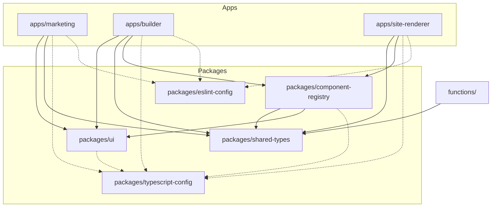

# Monorepo Layout Specification (Turborepo)

**Ticket:** DOC-007 · Platform Phase 2 prep (P2-W2)  
**Document owner:** Dr. Lena Moreau  
**Domain experts:** Dr. Michael Chen (platform architecture) · Dr. Daniel Moreau (CI / FinOps) · Dr. Marcus Wei (monorepo) · Dr. Lena Petrova (Next.js)  
**Status:** **Frozen** — B0 gate document (no B0-001 code until this + DOC-006 are approved)  
**Last updated:** 12 June 2026  
**Blocks:** B0-001 (Turborepo scaffold)  
**Related:** [`../specs/codedpixels-project-plan.md`](../specs/codedpixels-project-plan.md) §7, Q24, Q29 · [`../specs/builder-ui-spec.md`](../specs/builder-ui-spec.md) §3, §5.2, §6, §12 · [`implementation-tickets.md`](implementation-tickets.md) B0-001 · [`expert-review-memo.md`](expert-review-memo.md) P1 monorepo + hosting notes

**Aligned with Dr. Michael Chen on B0 layout** — three App Hosting backends (marketing, builder, site-renderer); shared packages for registry, types, and UI; Firebase `functions/` remains at repo root.

---

## 1. Purpose

This document is the **implementation contract** for **B0-001** and all Platform Phase 2 package splits. It defines:

- Target Turborepo directory layout
- npm workspace package boundaries and naming
- `turbo.json` task pipeline (build, test, lint, typecheck)
- Placement of Firebase Cloud Functions
- Migration path from the current **single Next.js app at repo root** (M0–M4)
- Dependency graph between apps and packages

**Out of scope (other docs):** Site renderer ISR / wildcard routing detail → [`../specs/site-renderer-architecture.md`](../specs/site-renderer-architecture.md) (DOC-006). Builder UX → [`../specs/builder-ui-spec.md`](../specs/builder-ui-spec.md).

---

## 2. Decision summary

| Question | Decision | Rationale |
|----------|----------|-----------|
| Monorepo tool | **Turborepo** + **npm workspaces** | Project plan + expert-review memo P1; matches existing `package-lock.json` workflow |
| `apps/builder` vs `apps/site-renderer` | **Separate apps** (not combined) | builder-ui-spec §5.2: live site is a distinct backend on `*.codedpixels.co.uk`; expert-review memo — three App Hosting backends |
| Component registry location | **`packages/component-registry`** | Shared by builder canvas, builder preview routes, and site-renderer (Q34, builder-ui-spec §3) |
| Firebase Functions | **`functions/` at repo root** | Firebase CLI convention; single deploy target; not an App Hosting app |
| Marketing migration | **`apps/marketing`** | Current root `app/`, `components/`, `lib/` move here in B0-001 |
| Workspace tooling packages | **`packages/typescript-config`**, **`packages/eslint-config`** | Dr. Daniel Moreau — one CI lint/typecheck baseline across apps (added in B0-001 scaffold) |

---

## 3. Target repository layout

```
codedpixels/                          # repo root — Firebase + Turborepo root
├── apps/
│   ├── marketing/                    # codedpixels.co.uk — configurator + static pages (M0–M4 app)
│   │   ├── app/                      # Next.js 15 App Router
│   │   ├── components/               # marketing-only (configurator, sections, hero)
│   │   ├── lib/                      # pricing, config-state, templates, features
│   │   ├── public/
│   │   ├── e2e/                      # Playwright — marketing flows only
│   │   ├── next.config.ts
│   │   ├── package.json              # name: @codedpixels/marketing
│   │   └── tsconfig.json
│   │
│   ├── builder/                      # app.codedpixels.co.uk — dashboard + editor + draft preview
│   │   ├── app/                      # /dashboard, /onboarding, /sites/{id}/preview
│   │   ├── components/               # builder chrome (palette, props panel, top bar)
│   │   ├── lib/                      # builder-only helpers (selection, drag-drop)
│   │   ├── next.config.ts
│   │   ├── package.json              # name: @codedpixels/builder
│   │   └── tsconfig.json
│   │
│   └── site-renderer/                # *.codedpixels.co.uk — public published sites only
│       ├── app/                      # catch-all tenant routes + middleware
│       ├── middleware.ts             # hostname → slug resolution (DOC-006)
│       ├── next.config.ts
│       ├── package.json              # name: @codedpixels/site-renderer
│       └── tsconfig.json
│
├── packages/
│   ├── ui/                           # @codedpixels/ui — Button, Card, Toggle, brand tokens
│   │   ├── src/
│   │   └── package.json
│   │
│   ├── component-registry/           # @codedpixels/component-registry
│   │   ├── src/
│   │   │   ├── registry.ts           # type → definition map
│   │   │   ├── schemas/              # Zod per section type (hero, text-block, …)
│   │   │   ├── components/           # React renderers (shared live + canvas)
│   │   │   └── editor-panels/        # builder-only sidebar fields (imported by apps/builder)
│   │   └── package.json
│   │
│   ├── shared-types/                 # @codedpixels/shared-types
│   │   ├── src/
│   │   │   ├── section.ts            # Section, ComponentType
│   │   │   ├── firestore/            # companies, sites, pages, versions (read-only shapes)
│   │   │   └── marketing/            # ConfigState, FeatureId, TemplateId (from types/index.ts)
│   │   └── package.json
│   │
│   ├── typescript-config/            # @codedpixels/typescript-config — shared tsconfig bases
│   └── eslint-config/                # @codedpixels/eslint-config — shared ESLint flat config
│
├── functions/                        # Firebase Cloud Functions (unchanged location)
│   ├── src/
│   │   ├── index.ts
│   │   ├── callables/                # submitSignup, publishSite, provisionTenant, …
│   │   └── lib/
│   ├── package.json                  # name: codedpixels-functions
│   └── tsconfig.json
│
├── tests/
│   └── firestore/                    # rules unit tests (repo root — cross-cutting)
│
├── docs/                             # unchanged
├── firebase.json                     # root — firestore, functions, storage, emulators
├── firestore.rules
├── firestore.indexes.json
├── storage.rules
├── turbo.json
├── package.json                      # workspaces root; orchestration scripts
└── package-lock.json
```

### 3.1 App Hosting backends (deployment mapping)

| App package | Domain(s) | Firebase App Hosting backend | Phase |
|-------------|-----------|------------------------------|-------|
| `@codedpixels/marketing` | `codedpixels.co.uk`, `www.codedpixels.co.uk` | `marketing` | M4 → migrated in B0-001 |
| `@codedpixels/builder` | `app.codedpixels.co.uk` | `builder` | B2-001+ |
| `@codedpixels/site-renderer` | `*.codedpixels.co.uk` (wildcard) | `site-renderer` | B4-001 |

Each app has its own `apphosting.yaml` (or equivalent) under its directory. **Do not** deploy all three from one Next.js `output: 'standalone'` root.

### 3.2 Why builder and site-renderer are separate

Per builder-ui-spec §5.2 and expert-review memo (Marcus Rivera, Michael Chen):

- **Builder** serves auth-gated draft preview (`draftVersionId`), editor chrome, and dashboard — cookies/session on `app.codedpixels.co.uk`.
- **Site-renderer** serves public ISR pages from `publishedVersionId` on tenant subdomains — no builder session, aggressive cache, wildcard hostname routing.
- Combining them would mix auth models, bundle size, and cache headers on one deploy surface.

Both apps import **`@codedpixels/component-registry`** renderers so draft canvas, in-app preview, and live site stay pixel-consistent.

---

## 4. Package responsibilities

### 4.1 `@codedpixels/marketing`

- **Owns:** Landing, configurator, `/templates`, `/pricing`, `/get-started`, legal pages, sitemap/robots, GA4 (consent-gated).
- **Imports:** `@codedpixels/ui`, `@codedpixels/shared-types` (marketing subset).
- **Does not import:** `@codedpixels/component-registry` (marketing preview uses configurator components, not builder section types).

### 4.2 `@codedpixels/builder`

- **Owns:** Onboarding wizard, dashboard routes, editor layout, draft preview routes, publish UI.
- **Imports:** `@codedpixels/ui`, `@codedpixels/shared-types`, `@codedpixels/component-registry` (renderers + editor panels).

### 4.3 `@codedpixels/site-renderer`

- **Owns:** Tenant middleware, published page routes, on-demand revalidation API route (secret-protected, B3-001).
- **Imports:** `@codedpixels/component-registry` (renderers only — **no** editor panels), `@codedpixels/shared-types`.
- **Does not import:** `@codedpixels/ui` builder chrome (optional: minimal `@codedpixels/ui` primitives for error pages only).

### 4.4 `@codedpixels/component-registry`

- **Owns:** Section type definitions, Zod schemas, React `Component` renderers, `defaultProps`, palette metadata.
- **Exports:**
  - `@codedpixels/component-registry` — registry map + renderers (safe for site-renderer bundle).
  - `@codedpixels/component-registry/editor-panels` — builder-only sidebar components (tree-shaken out of site-renderer if imported via subpath).
- **Imports:** `@codedpixels/shared-types`, `@codedpixels/ui` (for rendered section UI), `zod`.

### 4.5 `@codedpixels/shared-types`

- **Owns:** Cross-cutting TypeScript types — no React, no Firebase SDK.
- **Consumers:** All apps, `functions/` (duplicate-free shapes for Callable payloads), `@codedpixels/component-registry`.
- **Migration source:** Root `types/index.ts`, relevant Firestore document interfaces from schema doc.

### 4.6 `@codedpixels/ui`

- **Owns:** Design-system primitives aligned with [`../brand/brand-guide.md`](../brand/brand-guide.md) — colours via CSS variables, Button, Card, Badge, Toggle.
- **Migration source:** Root `components/ui/`, shared tokens from `app/globals.css`.

### 4.7 `functions/` (root, not under `apps/`)

- **Stays at repo root** — Firebase CLI `firebase.json` → `"source": "functions"`.
- **Imports:** `@codedpixels/shared-types` via workspace dependency (`"dependencies": { "@codedpixels/shared-types": "*" }`) after B0-001; Zod schemas for Callables may re-use or mirror registry schemas (prefer importing shared Zod from registry where publish validation overlaps).
- **Turbo membership:** Included as workspace package `"functions"` for `lint`, `test`, `build` tasks in CI.
- **Deploy:** `firebase deploy --only functions` from repo root; unaffected by Next.js app splits.

---

## 5. Dependency graph



**Allowed dependency rules (enforce in CI):**

| From | May depend on |
|------|----------------|
| `apps/marketing` | `ui`, `shared-types`, config packages |
| `apps/builder` | `ui`, `shared-types`, `component-registry`, config packages |
| `apps/site-renderer` | `shared-types`, `component-registry` (renderers subpath), config packages |
| `packages/component-registry` | `shared-types`, `ui`, `zod` |
| `packages/ui` | `shared-types` (optional), React peer deps |
| `packages/shared-types` | *(none — leaf package)* |
| `functions/` | `shared-types`, `zod`, `firebase-*` |

**Forbidden:**

- `site-renderer` → `builder` (or any app → app)
- `shared-types` → any app or registry
- `component-registry` → `apps/*`
- Client apps → `functions/` source

---

## 6. Root `package.json` and workspaces

```json
{
  "name": "codedpixels",
  "private": true,
  "workspaces": [
    "apps/*",
    "packages/*",
    "functions"
  ],
  "scripts": {
    "dev": "turbo run dev --filter=@codedpixels/marketing",
    "dev:marketing": "turbo run dev --filter=@codedpixels/marketing",
    "dev:builder": "turbo run dev --filter=@codedpixels/builder",
    "dev:renderer": "turbo run dev --filter=@codedpixels/site-renderer",
    "build": "turbo run build",
    "test": "turbo run test",
    "lint": "turbo run lint",
    "typecheck": "turbo run typecheck",
    "test:rules": "firebase emulators:exec --only firestore \"vitest run --config vitest.rules.config.ts\"",
    "test:e2e": "turbo run test:e2e --filter=@codedpixels/marketing",
    "emulators": "firebase emulators:start --only auth,firestore,functions,storage"
  },
  "devDependencies": {
    "turbo": "^2.x",
    "typescript": "^5"
  },
  "packageManager": "npm@10.x"
}
```

Each workspace package declares its own `dev`, `build`, `test`, `lint`, `typecheck` scripts. Root scripts delegate to Turborepo.

---

## 7. `turbo.json` pipeline

**Owner:** Dr. Daniel Moreau — cache keys and CI fan-out.

```json
{
  "$schema": "https://turbo.build/schema.json",
  "globalDependencies": [
    ".env.example",
    "tsconfig.json"
  ],
  "tasks": {
    "build": {
      "dependsOn": ["^build"],
      "outputs": [".next/**", "!.next/cache/**", "dist/**", "lib/**"],
      "env": [
        "NODE_ENV",
        "NEXT_PUBLIC_*",
        "SENTRY_*"
      ]
    },
    "test": {
      "dependsOn": ["^build"],
      "outputs": ["coverage/**"],
      "cache": true
    },
    "lint": {
      "dependsOn": ["^lint"],
      "outputs": []
    },
    "typecheck": {
      "dependsOn": ["^build"],
      "outputs": []
    },
    "dev": {
      "cache": false,
      "persistent": true
    },
    "test:e2e": {
      "dependsOn": ["build"],
      "cache": false
    }
  }
}
```

### 7.1 Task notes

| Task | Scope | Notes |
|------|-------|-------|
| `build` | All apps + `component-registry` + `functions` | Next.js apps: `next build`. Packages: `tsc` → `dist/`. Functions: `tsc` → `lib/`. |
| `test` | Vitest in apps/packages/functions | Marketing pricing/config tests move with `apps/marketing`. Rules tests stay root (`test:rules`). |
| `lint` | ESLint per package | Shared `@codedpixels/eslint-config`. |
| `typecheck` | `tsc --noEmit` per package | Strict — no cross-package type escapes. |
| `test:e2e` | `apps/marketing` only (Phase 2) | Builder E2E added in later B-tickets; not in B0-001 scope. |

### 7.2 CI invocation (B0-001+)

Nathan / CI runs from repo root:

```bash
npm ci
turbo run lint typecheck test build
npm run test:rules          # Firestore rules — root script, not turbo-cached initially
```

**FinOps (Daniel Moreau):** Turborepo remote cache optional post-B0; local cache sufficient for solo B0-001. Enable remote cache before parallel B2+ agents.

---

## 8. Migration path (single app → monorepo)

Current state (M0–M4): Next.js app at repo root — `app/`, `components/`, `lib/`, `types/`, root `package.json`.

### Phase A — B0-001 scaffold (solo ticket)

1. Add root `turbo.json`, workspace `package.json`, `packages/typescript-config`, `packages/eslint-config`.
2. Create `apps/marketing/` and **move** (not copy) marketing source:
   - `app/` → `apps/marketing/app/`
   - `components/` → `apps/marketing/components/`
   - `lib/` → `apps/marketing/lib/`
   - `public/` → `apps/marketing/public/`
   - `e2e/` → `apps/marketing/e2e/`
   - `next.config.ts`, `postcss.config.mjs`, Sentry configs → `apps/marketing/`
3. Extract `packages/shared-types` from `types/index.ts` + stable Firestore shapes.
4. Extract `packages/ui` from `components/ui/` + shared CSS variables.
5. Wire `@codedpixels/marketing` dependencies on workspace packages.
6. Update import paths (`@/` → app-local or `@codedpixels/*`).
7. Move `vitest.config.ts` (unit tests) into `apps/marketing` or root with project references.
8. Keep `tests/firestore/`, `vitest.rules.config.ts`, `firebase.json`, `firestore.rules` at **root**.
9. Add `functions` to workspaces; verify `npm run build` inside `functions/` still works.
10. Verify: `turbo run lint typecheck test build --filter=@codedpixels/marketing` green; `npm run test:rules` green; marketing E2E green.

**B0-001 must not** add builder or site-renderer app code — empty package shells optional with README placeholder only.

### Phase B — B2-002 + B2-001 (parallel)

- Scaffold `apps/builder` (shell routes).
- Implement `packages/component-registry` with MVP section types (builder-ui-spec §3.1).
- Builder imports registry; marketing unchanged.

### Phase C — B4-001 (after DOC-006 + B3-001)

- Scaffold `apps/site-renderer` with middleware + wildcard hosting config.
- Site-renderer imports registry renderers only.

### Phase D — Ongoing extraction

- Callable payload types: consolidate into `@codedpixels/shared-types` as Functions are added (B1, B3, B6).
- Optional future: `packages/templates` for seed section JSON (expert-review memo P3) — **not** in B0 scope.

### Migration invariants

- **No behaviour change** during Phase A — URL routes, pricing, configurator, and Firebase Callables behave identically post-move.
- **Single commit wave** for B0-001 migration (Nathan integrates).
- **Import alias:** Each app keeps `"@/*": ["./src/*"]` or `"@/*": ["./*"]` locally; cross-package imports use `@codedpixels/*` only.

---

## 9. Firebase and tooling at repo root

These files **remain at repository root** after B0-001:

| Path | Reason |
|------|--------|
| `firebase.json`, `.firebaserc` | Firebase project binding |
| `firestore.rules`, `firestore.indexes.json` | Single Firestore database |
| `storage.rules` | Single Storage bucket |
| `tests/firestore/` | Cross-app security rules tests |
| `vitest.rules.config.ts` | Rules test runner config |
| `playwright.config.ts` | May stay root with `testDir: apps/marketing/e2e` or move per-app |
| `.env.example` | Document all apps; per-app `.env.local` allowed |

---

## 10. Acceptance checklist (DOC-007)

- [x] Defines `apps/marketing`, `apps/builder`, `apps/site-renderer` with deployment mapping
- [x] Resolves builder vs site-renderer: **separate apps**
- [x] Defines `packages/ui`, `packages/component-registry`, `packages/shared-types`
- [x] Places `functions/` at repo root with workspace membership
- [x] Specifies `turbo.json` pipeline (build, test, lint, typecheck)
- [x] Documents migration from current single-app layout
- [x] Includes dependency graph and forbidden edges
- [x] Aligned with project plan Q29 (three surfaces), builder-ui-spec §5.2 / §6 / §12
- [x] CI notes for Dr. Daniel Moreau

---

## 11. References

| Source | Relevant section |
|--------|------------------|
| Project plan | §7 structure, Q24 hosting, Q29 Firebase layout, Q34–Q35 publish |
| Builder UI spec | §3 registry, §5.2 preview model, §6 renderer, §12 hosting |
| Expert review memo | P1 monorepo (Marcus Wei); three backends (Marcus Rivera, Michael Chen) |
| Implementation tickets | B0-001, B2-002, B4-001; B0 gate DOC-006 + DOC-007 |

**Approved for B0-001 implementation:** ☑ Dr. Michael Chen · ☑ Dr. Daniel Moreau · Dr. Lena Moreau (doc owner)
