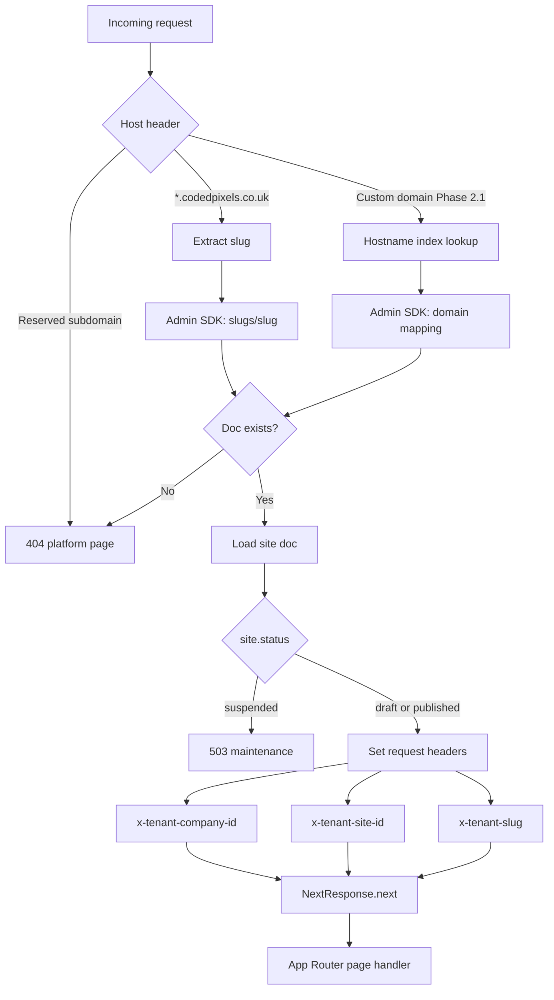

# CodedPixels — Site Renderer Architecture

**Document Owner:** Dr. Lena Moreau  
**Architecture:** Dr. Michael Chen (Platform), Dr. Lena Petrova (Next.js), Dr. Marcus Rivera (Hosting)  
**Security:** Dr. Victor Lang, Dr. Rafael Ortiz  
**Status:** Canonical — B0 gate doc; blocks **B4-001**  
**Region:** `europe-west2` (London)  
**Parent specs:** [`codedpixels-project-plan.md`](codedpixels-project-plan.md) Q35, Q37, Q60 · [`builder-ui-spec.md`](builder-ui-spec.md) §6, §12 · [`firestore-schema.md`](firestore-schema.md) §5.1, §7

**Expert alignment:** Aligned with Dr. Michael Chen on architecture · Dr. Lena Petrova on Next.js ISR and package boundaries.

---

## 1. Purpose

This document defines the **Platform Phase 2 live site renderer** — the Next.js App Hosting backend that serves tenant websites at `{slug}.codedpixels.co.uk` (and custom domains in Phase 2.1). It is the implementation contract for **B4-001** and the revalidation contract for **B3-001**.

**In scope (Phase 2 MVP):**

- Wildcard subdomain hosting on a **single shared** `site-renderer` backend
- Hostname → tenant resolution via `slugs/{slug}` (Admin SDK only)
- Published-page rendering from `publishedVersionId` version docs
- Shared component registry with the builder (same React components, same Zod schemas)
- ISR with on-demand revalidation triggered by `publishSite`
- Public form submission via Callable `submitLead` (App Check + reCAPTCHA)
- Draft isolation — no draft content on public routes

**Out of scope (Phase 2 MVP):**

- Custom domain DNS UI and verification (Platform Phase 2.1 — Q37, Q60)
- Per-tenant Firebase Hosting sites (rejected — expert-review memo)
- Ecommerce checkout on client sites (Phase 2.1+)
- Version history / rollback UI (Phase 2.1 — Q53)

---

## 2. Deployment Topology

Three **separate** Firebase App Hosting backends in one GCP project (expert-review memo; Q29):

| Backend | Domain(s) | Role |
|---------|-----------|------|
| **marketing** | `codedpixels.co.uk`, `www.codedpixels.co.uk` | M0–M4 configurator + marketing |
| **builder** | `app.codedpixels.co.uk` | Dashboard, builder canvas, auth-gated preview |
| **site-renderer** | `*.codedpixels.co.uk` (wildcard) | Public live tenant sites |

**Key decision (Q24 amendment):** `provisionTenant` writes `slugs/{slug}` — it does **not** create a new Hosting site per tenant. All subdomains route to the shared `site-renderer` backend via wildcard DNS + App Hosting.

```
                    ┌─────────────────────┐
                    │  Firebase (single)   │
                    │  europe-west2        │
                    └──────────┬──────────┘
           ┌───────────────────┼───────────────────┐
           ▼                   ▼                   ▼
    ┌──────────────┐    ┌──────────────┐    ┌──────────────────┐
    │  marketing   │    │   builder    │    │  site-renderer   │
    │ codedpixels  │    │ app.coded    │    │ *.codedpixels    │
    │   .co.uk     │    │ pixels.co.uk │    │   .co.uk         │
    └──────────────┘    └──────────────┘    └──────────────────┘
```

Custom domains (Phase 2.1): additional hostnames mapped to the **same** `site-renderer` backend via Firebase Hosting API — not a fourth backend.

---

## 3. Hostname Resolution

### 3.1 Subdomain (Phase 2 MVP)

Default live URL: `https://{slug}.codedpixels.co.uk`

| Input | Extraction | Lookup |
|-------|------------|--------|
| `https://acme-clean.codedpixels.co.uk/about` | `slug = acme-clean` | `slugs/acme-clean` |
| `https://acme-clean.codedpixels.co.uk` | `slug = acme-clean` | `slugs/acme-clean` |

**`slugs/{slug}` document** ([`firestore-schema.md`](firestore-schema.md) §5.1):

| Field | Use |
|-------|-----|
| `companyId` | Tenant root |
| `siteId` | Site under `companies/{companyId}/sites/{siteId}` |

**Resolution rules:**

1. Parse `Host` header; strip port if present.
2. If host matches `^([a-z0-9-]+)\.codedpixels\.co\.uk$` → capture group 1 as `slug`.
3. Reserved subdomains (hard deny — no slug lookup): `app`, `www`, `api`, `staging`, `preview`.
4. Admin SDK `get(slugs/{slug})` — **never** expose slug index to browser clients (rules deny all reads).
5. On miss → render platform 404 (not tenant-branded).
6. On hit → load `companies/{companyId}/sites/{siteId}`; if `status === 'suspended'` → 503 maintenance page.

### 3.2 Custom domain (Phase 2.1 — Q37)

When `sites/{siteId}/domains/{domainId}` has `status: active`:

1. Middleware receives `Host: www.acme-clean.co.uk`.
2. Lookup via **server-side index** (Phase 2.1): `hostname → { companyId, siteId }` — stored on domain doc or denormalised lookup collection; **not** public client read.
3. Same render pipeline as subdomain once tenant context is resolved.

Onboarding Step 3 assigns subdomain only (Q60). Custom domain UI is deferred to Platform Phase 2.1.

### 3.3 Local development

| Env var | Purpose |
|---------|---------|
| `SITE_RENDERER_DEV_SLUG` | Pin tenant when host is `localhost:3002` |
| `FIREBASE_ADMIN_*` | Admin SDK for slug + published content reads |

Dev proxy: `acme-clean.localhost:3002` optional via `/etc/hosts` + wildcard not required locally.

---

## 4. Middleware Flow

All tenant routing runs in **Next.js middleware** on the `site-renderer` app before App Router handlers execute.



**Headers injected (internal only — strip from outbound responses):**

| Header | Value |
|--------|-------|
| `x-tenant-company-id` | `companyId` from slug doc |
| `x-tenant-site-id` | `siteId` from slug doc |
| `x-tenant-slug` | Resolved slug (subdomain or mapped) |

Route handlers read tenant context from headers via `lib/tenant-context.ts` — **never** from URL query params supplied by the client.

**Matcher config:** Run middleware on all paths except `_next/static`, `_next/image`, `favicon.ico`, and static assets under `/public`.

---

## 5. Request → Page Render Pipeline

### 5.1 URL → page mapping

| Path | Page resolution |
|------|-----------------|
| `/` | `sites/{siteId}.homepagePageId` |
| `/{pageSlug}` | `pages` where `slug == pageSlug` (e.g. `/about` → page with `slug: "about"`) |
| `/home` | Same as page slug `home` if defined; prefer `/` for homepage |

**404:** Unknown page slug for tenant → tenant-branded 404 component (not platform 404).

**No publish yet:** If `publishedVersionId` is missing → placeholder page (“Coming soon” / onboarding CTA) — never fall back to `draftVersionId`.

### 5.2 Data loading (published only)

For each page render (Server Component):

```
1. Read page doc: companies/{companyId}/sites/{siteId}/pages/{pageId}
2. Require page.publishedVersionId — else placeholder
3. Read version: .../versions/{publishedVersionId}
4. Assert version.status === 'published'
5. Pass version.sections[] to SectionRenderer
```

**Data access:** Firebase Admin SDK in server components / route handlers only. The site-renderer **does not** initialise the client Firestore SDK for page content — eliminates accidental draft reads and keeps slug index server-side.

**Asset resolution:** Section props store `assetId` (not raw URLs). Renderer resolves `companies/.../assets/{assetId}` via Admin SDK; only serve assets with `scanStatus === 'clean'`.

**Navigation:** List pages with `orderBy('sortOrder')` where each nav target has a `publishedVersionId` (omit unpublished pages from nav).

### 5.3 Section rendering

```typescript
// packages/renderer/src/SectionRenderer.tsx (conceptual)
sections.map((section) => {
  const entry = registry[section.type];
  if (!entry) return <UnknownSectionFallback />; // log to Sentry
  const props = entry.schema.parse(section.props);
  return <entry.Component key={section.id} {...props} tenant={tenantContext} />;
});
```

Max nesting depth **2** per [`firestore-schema.md`](firestore-schema.md) §3. Unknown `type` or Zod failure → skip section + Sentry warning (do not crash entire page).

---

## 6. Component Registry Sharing

The registry is **code**, not Firestore (`firestore-schema.md` §1 — no `componentRegistry/` in Phase 2).

### 6.1 Package layout (B0)

| Package | Contents | Consumed by |
|---------|----------|-------------|
| `@codedpixels/registry` | `type`, `label`, `schema` (Zod), `defaultProps`, `category` | Builder palette, `publishSite` validation |
| `@codedpixels/renderer` | `Component` (React), `SectionRenderer`, Tiptap read-only mapper | Builder canvas, preview route, **site-renderer** |
| `@codedpixels/types` | `Section`, `FeatureId`, shared interfaces | All apps |

**Builder-only** (not imported by site-renderer production bundle):

- `EditorPanel` — props sidebar
- Drag/reorder chrome, selection wrappers

### 6.2 Shared render contract

| Surface | Data source | Registry import |
|---------|-------------|-----------------|
| Builder canvas | `draftVersionId` | `@codedpixels/renderer` |
| Auth preview (`app.codedpixels.co.uk/.../preview`) | `draftVersionId` | `@codedpixels/renderer` |
| **Live site** | `publishedVersionId` | `@codedpixels/renderer` |

Same `Component` ensures WYSIWYG parity (Q35). `publishSite` validates with the same Zod `schema` exported from `@codedpixels/registry`.

### 6.3 Feature-gated components

Gated types (e.g. `product-grid` without `ecommerce`) may exist in published sections only if `publishSite` validated `featureIds` server-side. Renderer may double-check `sites/{siteId}.featureIds` and render upgrade placeholder if mismatch detected (defence in depth).

### 6.4 White-label (Q30)

When `white-label` add-on active: omit “Powered by CodedPixels” footer badge on live site. Renderer reads `featureIds` from site doc at render time.

---

## 7. ISR & Revalidation (Q35)

### 7.1 Strategy

| Layer | Mechanism | TTL |
|-------|-----------|-----|
| HTML (App Router) | `export const revalidate = 3600` default | 1 hour stale-while-revalidate |
| On-demand | `revalidatePath` / `revalidateTag` after publish | Immediate invalidation |
| Firestore reads | Per-request in Server Components (no client cache) | N/A |
| CDN | Firebase App Hosting edge cache honours Next cache headers | Follows ISR |

**Goal:** Publish feels instant (Q35) without redeploying the `site-renderer` backend per edit.

### 7.2 `publishSite` → revalidation sequence

After `publishSite` Cloud Function copies draft → published and updates `publishedVersionId` ([`builder-ui-spec.md`](builder-ui-spec.md) §7.1):

```
1. For each affected page:
   - Set publishedVersionId on page doc
   - Archive prior published versions (max 5 — Q53)
2. HTTP POST to site-renderer revalidation API (server-to-server)
3. SendGrid site-published email (Q41)
```

### 7.3 Revalidation API contract

**Route:** `POST /api/revalidate` on **site-renderer** backend only.

**Auth:** Shared secret header `x-revalidate-secret` matching `REVALIDATE_SECRET` env var (rotated via Secret Manager). Called from `publishSite` via Cloud Functions `fetch` — not exposed to browsers.

**Request body:**

```typescript
interface RevalidateRequest {
  companyId: string;
  siteId: string;
  slug: string;           // for path construction
  paths?: string[];       // e.g. ['/', '/about'] — default: all published pages
  tags?: string[];        // optional: [`site:${siteId}`]
}
```

**Handler behaviour:**

1. Validate secret — 401 on mismatch.
2. `revalidateTag(`site:${siteId}`)` if tags provided.
3. For each path: `revalidatePath(`/${path}`)` on tenant host context, or use tag-based invalidation scoped to tenant.
4. Return `{ revalidated: true, paths: string[], at: ISO8601 }`.

**Idempotency:** Safe to retry; duplicate revalidation is a no-op.

**Rollback (Phase 2.1):** `restorePublishedVersion` uses the same API after swapping `publishedVersionId`.

### 7.4 Cache tags (recommended)

| Tag | Invalidated when |
|-----|------------------|
| `site:{siteId}` | Any publish on site |
| `page:{siteId}:{pageId}` | Single page publish (future partial publish) |

Server Components wrap data fetches with `unstable_cache` keyed by `siteId + pageId + publishedVersionId` so version swap busts cache without waiting for TTL.

---

## 8. Caching Strategy

### 8.1 What is cached

| Asset | Cache location | Invalidation |
|-------|----------------|--------------|
| Rendered HTML | CDN + Next ISR | `publishSite` revalidation API |
| `sections` JSON (derived) | `unstable_cache` in RSC | Tag `site:{siteId}` or versionId in key |
| Images (Storage) | `next/image` + CDN | Asset URL token refresh; new asset upload does not auto-revalidate page — republish or manual revalidate |
| `slugs/{slug}` lookup | Short TTL in-memory (middleware) | 60s max; slug changes rare (provision only) |
| Font/CSS/JS static chunks | Immutable `/_next/static/*` | Deploy only |

### 8.2 What is never cached publicly

| Data | Reason |
|------|--------|
| Draft version docs | Auth-only; not loaded by site-renderer |
| `slugs/` index | Security — server-only |
| Lead form POST bodies | Writable PII — Function only |
| Member/session data | Builder backend only |

### 8.3 Stale content bounds

- **Worst case without revalidation API failure:** 1 hour (ISR TTL).
- **Target after publish:** &lt; 5 seconds to fresh HTML at edge (revalidation + CDN propagation).
- **Monitoring:** Sentry breadcrumb on revalidation failure; alert if `publishSite` succeeds but revalidate returns non-2xx.

---

## 9. Public Forms & App Check (Q49)

Contact, quote, and booking forms on live sites submit via Callable **`submitLead`** — not direct Firestore writes.

### 9.1 Client flow (site-renderer)

```
1. User fills form on {slug}.codedpixels.co.uk
2. Firebase App Check token obtained (reCAPTCHA Enterprise / debug provider in dev)
3. reCAPTCHA v3 execute on submit
4. httpsCallable('submitLead') with:
   - companyId, siteId (from server-injected page props — not user-editable)
   - pageId, formSectionId, formType
   - fields map
   - appCheckToken (automatic)
   - recaptchaToken
5. Function validates, rate-limits, writes leads/{leadId}
6. UI shows successMessage from section props
```

### 9.2 `submitLead` hardening

| Control | Setting |
|---------|---------|
| App Check | `enforceAppCheck: true` |
| reCAPTCHA v3 | Score threshold ≥ 0.5 (tune in B9) |
| Rate limit | 10 submissions / hour / IP / form (`source.formSectionId`) |
| Honeypot | Hidden field — reject if filled |
| Payload | Zod validate; strip HTML from string fields |
| Write | Admin SDK → `companies/.../leads/` |
| Usage | Increment `usage/{YYYY-MM}.formSubmissions` |

Site-renderer initialises **Firebase App Check** on the client bundle for form pages only (dynamic import) — marketing and builder use separate App Check debug tokens per backend.

### 9.3 Error UX

| Error | User message |
|-------|----------------|
| Rate limited | *“Too many requests — try again later.”* |
| Failed App Check / bot | *“Couldn’t send — please refresh and try again.”* |
| Network | *“Something went wrong — please try again.”* |

Do not leak internal IDs or stack traces to the browser.

---

## 10. Security — No Draft Leakage

### 10.1 Threat model

| Threat | Mitigation |
|--------|------------|
| Read draft via public URL | Renderer loads `publishedVersionId` only; rules deny draft reads |
| Guess `versionId` in URL | No version IDs in public URLs; no API exposes version collection |
| Slug enumeration → tenant data | `slugs/` deny all client reads; rate-limit 404s at WAF Phase 3 |
| Host header injection | Resolve tenant from `Host` only in middleware; ignore `?siteId=` params |
| Cache poisoning | Tenant headers set server-side; ISR keys include `siteId` |
| XSS via section props | Zod parse per type; Tiptap JSON → sanitised HTML; no raw HTML sections |
| Form spam / credential stuffing | App Check + reCAPTCHA + rate limits (§9) |
| Suspended / cancelled tenant live | Check `companies.status` and `sites.status` before render |

### 10.2 Firestore rules alignment

From [`firestore-rules-spec.md`](firestore-rules-spec.md):

- `slugs/*` — deny all client access
- `versions/{id}` — public read **only** when `versionId == page.publishedVersionId` **and** `status == 'published'`
- Site-renderer uses **Admin SDK** — bypasses rules but must implement the same logical constraints in code (defence in depth)

### 10.3 Preview isolation

| Route | Backend | Data |
|-------|---------|------|
| Draft preview | **builder** (`app.codedpixels.co.uk`) | `draftVersionId`, auth required |
| Live site | **site-renderer** (`{slug}.codedpixels.co.uk`) | `publishedVersionId`, public |

**Never** serve draft content on `*.codedpixels.co.uk`. **Never** iframe live subdomain inside builder for draft preview ([`builder-ui-spec.md`](builder-ui-spec.md) §5.2).

### 10.4 Response headers (live site)

| Header | Value |
|--------|-------|
| `X-Robots-Tag` | `index, follow` (default; noindex for suspended placeholder) |
| `Cache-Control` | Set by Next ISR — do not override to `no-store` globally |
| Strip | `x-tenant-*` internal headers on outbound response |

---

## 11. Platform demo tenants (Wave 19, Q65)

Marketing template previews use **normal tenant documents** with `companies.isPlatformDemo: true`. No separate renderer code path beyond metadata and SEO.

| Concern | Contract |
|---------|----------|
| Resolution | Same as §3 — `slugs/{templateId}`; demo slugs **not** in `RESERVED_SUBDOMAINS` |
| Data load | `tenant-resolution.ts` reads `isPlatformDemo` from `companies/{companyId}` into `TenantContext` |
| SEO | `generateMetadata()` on `app/[[...pageSlug]]/page.tsx` sets `robots: { index: false, follow: false }` when `isPlatformDemo === true` |
| Analytics | No tenant GA4 in Phase 2 — N/A |
| Sentry | Tag events with `isPlatformDemo: true`; exclude from conversion dashboards |
| Seeding | Admin SDK only — see [`marketing-template-preview-spec.md`](../planning/marketing-template-preview-spec.md) §3 |

**Aligned with Dr. Rajiv Singh on noindex** · **Dr. Lena Petrova on metadata placement**

---

## 12. Observability & Errors

| Signal | Owner | Notes |
|--------|-------|-------|
| Sentry | Dr. Mira Solano | Separate DSN per backend; scrub PII in `beforeSend` |
| Revalidation failures | Alert | Tie to `publishSite` success metric |
| Unknown section types | Warning | Registry version drift — check `schemaVersion` |
| 404 rate per slug | Dashboard | Possible typo campaigns |

---

## 13. Route Map (site-renderer app)

| Route | Method | Auth | Purpose |
|-------|--------|------|---------|
| `/` | GET | Public | Homepage |
| `/[pageSlug]` | GET | Public | Secondary pages |
| `/api/revalidate` | POST | Secret header | ISR on-demand (§7.3) |
| `/api/health` | GET | None | App Hosting health check |
| `/_not-found` | GET | Public | Tenant or platform 404 |

No `/preview`, `/dashboard`, or `/api/admin` on this backend — those live on **builder**.

---

## 14. Implementation Milestones

| Ticket | Deliverable | Depends on |
|--------|-------------|------------|
| **B0-001** | `@codedpixels/registry`, `@codedpixels/renderer` packages | DOC-006, DOC-007 |
| **B3-001** | `publishSite` + revalidation API caller | DOC-006 |
| **B4-001** | `site-renderer` App Hosting backend + wildcard DNS | DOC-006, B3-001 |
| **B9-001** | App Check + `submitLead` client wiring on live forms | firestore-rules-spec §6 |
| **INF-005** | Demo tenant `noindex` + `TenantContext.isPlatformDemo` | marketing-template-preview-spec §5.1 |

---

## 15. Expert Sign-Off

| Expert | Domain | Status |
|--------|--------|--------|
| Dr. Michael Chen | Platform architecture | ☑ Approved |
| Dr. Lena Petrova | Next.js ISR, package boundaries | ☑ Approved |
| Dr. Marcus Rivera | Wildcard hosting, CDN | ☑ Approved |
| Dr. Victor Lang | Form abuse, draft isolation | ☑ Approved |
| Dr. Rafael Ortiz | Admin SDK data access | ☑ Approved |
| Dr. Lena Moreau | Documentation | ☑ Published |

---

## 16. Related Documents

| Document | Purpose |
|----------|---------|
| [`firestore-schema.md`](firestore-schema.md) | `slugs/`, pages, versions, leads |
| [`firestore-rules-spec.md`](firestore-rules-spec.md) | Published-only public reads |
| [`builder-ui-spec.md`](builder-ui-spec.md) | Preview vs live, publish flow |
| [`codedpixels-project-plan.md`](codedpixels-project-plan.md) | Q35, Q37, Q60 |
| [`../planning/expert-review-memo.md`](../planning/expert-review-memo.md) | Shared renderer decision |
| [`../planning/monorepo-layout-spec.md`](../planning/monorepo-layout-spec.md) | Package paths (DOC-007 — B0 gate) |

**Next action:** Freeze at B0 gate · **B3-001** implements revalidation caller · **B4-001** implements middleware + wildcard deploy.
